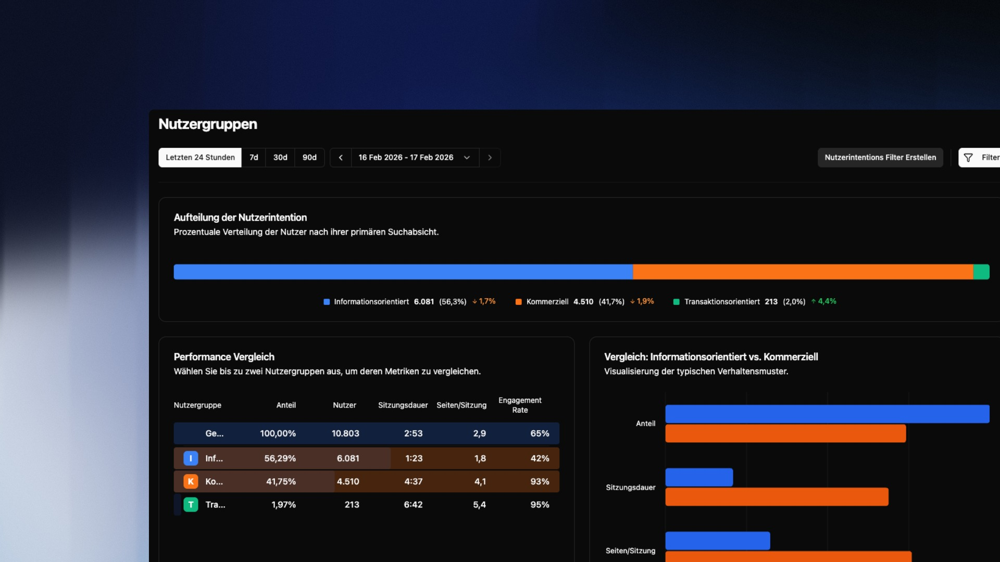
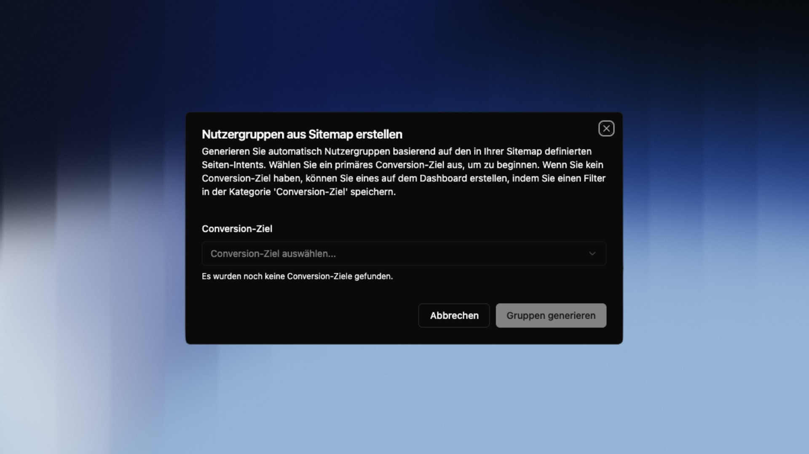

## Übersicht

Nutzergruppen klassifizieren jede Besuchersession automatisch nach der höchsten Kaufabsicht, die ein Nutzer in dieser Session gezeigt hat. Das Ergebnis sind drei klar trennbare Gruppen:

| Gruppe | Bedeutung |
|---|---|
| **Informativ** | Der Nutzer hat ausschließlich informative Inhalte konsumiert |
| **Kommerziell** | Der Nutzer hat Seiten mit kommerziellem Intent besucht (z.B. Pricing, Features, Vergleiche) |
| **Transaktionell** | Der Nutzer hat das definierte Conversion-Ziel ausgelöst |

Ein Nutzer, der in einer Session erst eine Preisseite besucht und dann kauft, wird als **transaktionell** eingestuft – es zählt immer die höchste erreichte Stufe der Session.

> [!NOTE]
> Nutzergruppen setzen zwei Dinge voraus: eine abgeschlossene **Sitemap-Klassifizierung** und ein definiertes **Conversion-Ziel**. Beides muss einmalig eingerichtet werden – die folgenden Schritte führen dich durch den Prozess.

---

## Voraussetzung: Sitemap-Klassifizierung

Die Basis für alle Nutzergruppen ist deine Sitemap-Klassifizierung. Dort legst du fest, welche Seiten deiner Website als informativ oder kommerziell eingestuft werden. bchic Analytics nutzt diese Zuordnung, um jede Session automatisch zu bewerten.

---

## Schritt 1: Conversion-Ziel definieren

Das Conversion-Ziel markiert den transaktionellen Endpunkt – der Moment, an dem ein Besucher zu einem Kunden oder Lead wird.

Typische Beispiele:

- Ein getätigter Kauf (`Event: purchase`)
- Eine erfolgreiche Registrierung (`URL: /thank-you-signup`)
- Eine Terminbuchung (`Event: booking_confirmed`)

> [!TIP]
> Wähle ein Ziel, das eindeutig und nicht umkehrbar ist. Eine Produktseite aufrufen zählt nicht – ein Kauf abschließen schon.

---

## Schritt 2: Filter für das Conversion-Ziel erstellen

Das Conversion-Ziel wird über die Filter-Funktion angelegt.

1. **Filterleiste öffnen** — Klicke oben rechts auf `Filter`.
2. **Kriterien wählen** — Definiere die Bedingung, die dein Ziel beschreibt, z.B. *Ereignis ist "purchase"* oder *Seitenpfad ist "/bestellung-vielen-dank"*.
3. **Speichern** — Klicke auf das **Disketten-Symbol** unten rechts in der Filterleiste.

Im Speichern-Dialog:

- **Filtername** — z.B. `Kauf abgeschlossen`
- **Kategorie** — Wähle zwingend `Conversion Ziel` aus

> [!WARNING]
> Ohne die Kategorie `Conversion Ziel` erscheint der Filter im nächsten Schritt nicht. Du kannst die Kategorie jederzeit nachträglich im Filter bearbeiten.

---

## Schritt 3: Gruppen generieren

Öffne **Nutzergruppen** und wähle im Popup unter **Conversion-Ziel** deinen soeben erstellten Filter aus. Klicke auf **Gruppen generieren**.

bchic Analytics wertet nun rückwirkend alle Sessions aus und weist jeder Session die höchste erreichte Intent-Stufe zu.

---

## Die Ergebnisse lesen

Nach der Generierung siehst du deine Sessions aufgeteilt nach Intent-Stufe. Für jede Gruppe kannst du analysieren:

- Über welche Kanäle kamen diese Nutzer?
- Welche Einstiegsseiten haben sie genutzt?
- Wie lange waren sie auf der Website?

Der direkte Vergleich zwischen **kommerziell** und **transaktionell** ist besonders wertvoll: Er zeigt dir, welche Nutzer kurz vor dem Abschluss stehen – aber noch nicht konvertiert haben.

> [!TIP]
> Kombiniere Nutzergruppen mit der Funnel Analyse, um den genauen Absprungpunkt kommerzieller Nutzer im Conversion-Pfad zu identifizieren.