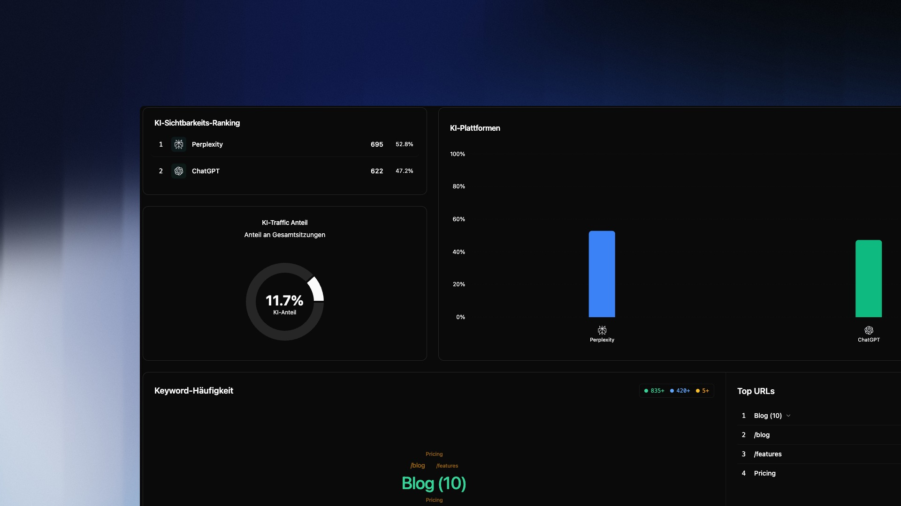

## Übersicht

KI Sichtbarkeit zeigt dir wie viel Traffic von KI-Plattformen wie ChatGPT oder Perplexity auf deine Website gelangt. Du siehst welche Plattformen dich am häufigsten referenzieren, welche Keywords dabei verwendet werden und welche Seiten deiner Website am stärksten von KI-Traffic profitieren.

Da KI-Assistenten zunehmend als Suchmaschinen genutzt werden, wird dieser Traffic-Kanal für viele Websites relevanter – besonders für informationsreiche Inhalte wie Blogs, Dokumentationen oder Vergleichsseiten.

---

## KI-Sichtbarkeits-Ranking

Das Ranking zeigt dir alle KI-Plattformen sortiert nach Klickvolumen. Für jede Plattform siehst du die absolute Anzahl der Sitzungen und den prozentualen Anteil am gesamten KI-Traffic.

---

## KI-Traffic Anteil

Das Donut-Diagramm zeigt den **KI-Anteil an deinen Gesamtsitzungen**. Dieser Wert gibt dir ein schnelles Gefühl dafür, wie bedeutend KI als Traffic-Kanal im Vergleich zu anderen Quellen wie organischer Suche oder Direct ist.

> Ein KI-Anteil über 10% ist aktuell für die meisten Websites ungewöhnlich hoch und deutet auf starke Präsenz in KI-Antworten hin – besonders wenn deine Inhalte faktisch und informativ sind.

---

## KI-Plattformen

Das Widget rechts daneben visualisiert den Traffic der einzelnen Plattformen als Balkendiagramm. Oben rechts kannst du zwischen zwei Ansichten wechseln:

- **Balkendiagramm** — Vergleich der Plattformen nach absolutem Volumen
- **Liniendiagramm** — Zeitlicher Verlauf des KI-Traffics pro Plattform

Das Liniendiagramm ist besonders nützlich um zu sehen zu welchen Tageszeiten KI-Traffic eintrifft und ob es Trends oder Einbrüche gibt.

---

## Keyword-Häufigkeit

Die Wortwolke zeigt die häufigsten Keywords, über die KI-Plattformen Nutzer auf deine Website schicken. Die Schriftgröße entspricht der Häufigkeit — größere Keywords tauchen öfter in KI-Antworten auf.

Die farbigen Punkte oben rechts filtern nach Häufigkeitsschwellen:
- **835+** — sehr häufig referenzierte Keywords
- **420+** — mittelfrequente Keywords
- **5+** — alle Keywords ab 5 Nennungen

> Keywords in der Wortwolke stammen aus den Referrer-Daten der KI-Plattformen. Nicht alle Plattformen übergeben diese Daten vollständig – bei manchen Sitzungen fehlt der Keyword-Kontext daher.

---

## Top URLs

Die Liste rechts zeigt welche Seiten deiner Website am meisten KI-Traffic erhalten. Gruppierte Seiten (z.B. `Blog (10)`) kannst du aufklappen um die einzelnen URLs zu sehen.

Nutze die **Suche** oben rechts um gezielt nach bestimmten URLs zu filtern.

---

## Typische Analysen

**Welche Inhalte performen bei KI am besten?**
Schau dir die Top URLs an und vergleiche sie mit deinen meistbesuchten organischen Seiten. Oft sind es andere Inhalte die bei KI gut abschneiden – häufig tiefgehende, faktische Artikel statt Landingpages.

**Welche KI-Plattform schickt den wertvollsten Traffic?**
Kombiniere KI Sichtbarkeit mit [Nutzergruppen](/de/intent/usergroups) und filtere nach KI als Referrer, um zu sehen ob ChatGPT- oder Perplexity-Nutzer eher transaktionell oder informativ agieren.

**KI-Traffic im Zeitverlauf beobachten**
Nutze das Liniendiagramm um zu sehen ob dein KI-Traffic wächst. Ein kontinuierlicher Anstieg ist ein Signal dass deine Inhalte zunehmend in KI-Antworten referenziert werden.