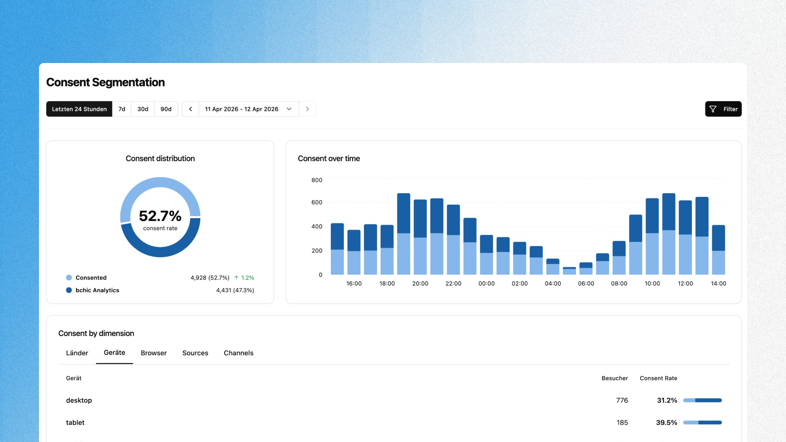

## Übersicht

Das Consent Segmentation Dashboard zeigt dir, wie sich deine Besucher nach Consent-Status aufteilen. Du siehst auf einen Blick, welcher Anteil deiner Nutzer Cookies akzeptiert hat und welcher ausschließlich über bchic Analytics (also cookieless) erfasst wird.

Das ist entscheidend, weil klassische Analytics-Tools wie Google Analytics nur den zugestimmten Anteil sehen. bchic zeigt dir beide Seiten und damit, wie groß dein blinder Fleck ohne cookieless Tracking wäre.

---

## Consent Tracking aktivieren

Bevor das Dashboard Daten zeigt, muss das Consent Tracking eingerichtet werden. Es gibt zwei Wege:

**Option 1: Über die Oberfläche**

Öffne das Consent Segmentation Dashboard. Wenn noch kein Consent Tracking aktiv ist, siehst du einen Hinweis mit dem Button **Skript konfigurieren**. Klicke darauf und folge der Anleitung, um das Tracking zu updaten. bchic erkennt automatisch gängige Consent Management Plattformen (CMPs) wie Cookiebot, OneTrust, Usercentrics oder jedes IAB TCF v2 kompatible CMP.

**Option 2: Manuell im Tracking Script**

Füge dem bchic Tracking-Script das Attribut `data-track-consent="true"` hinzu:

```html
<script
  defer
  src="https://analytics.bchic.de/script.js"
  data-website-id="deine-website-id"
  data-track-consent="true"
></script>
```

---

## Das Dashboard finden

Das Consent Segmentation Dashboard liegt unter **Nutzerverhalten → Consent Segmentation** in der Seitennavigation. Es erscheint erst, wenn das Consent Tracking aktiv ist und mindestens erste Sessions mit Consent-Status aufgezeichnet wurden.

---

## Dashboard-Komponenten

Das Dashboard besteht aus drei Hauptbereichen:

### Consent Verteilung

Das Donut-Diagramm zeigt die Gesamtverteilung deiner Besucher nach Consent-Status:

| Segment | Bedeutung |
|---|---|
| **Zugestimmt** | Besucher, die über das CMP aktiv zugestimmt haben. diese Sessions werden auch von cookie-basierten Tools erfasst |
| **bchic Analytics** | Besucher ohne Cookie-Consent. dieser Anteil wäre in klassischen Analytics-Tools unsichtbar |

Die zentrale Prozentzahl ist die **Zustimmungsrate**. der Anteil der Besucher mit aktivem Consent an der Gesamtbesucherzahl. Daneben siehst du die absolute Anzahl pro Segment und die Veränderung der Zustimmungsrate im Vergleich zum vorherigen Zeitraum.

### Consent im Zeitverlauf & Zeit bis Akzeptierung

Diese Card hat zwei Ansichten, zwischen denen du über die Tabs oben rechts wechselst.

**Consent** zeigt ein gestapeltes Balkendiagramm mit der Verteilung von Consent und Nicht-Consent-Sessions über die Zeit. So erkennst du Muster: Gibt es Tageszeiten oder Wochentage, an denen die Zustimmungsrate besonders hoch oder niedrig ist?

**Zeit bis Akzeptierung** zeigt, wie lange Besucher brauchen, bis sie dem Cookie-Banner zustimmen. Die Ansicht zeigt den Median sowie die Perzentile P50, P75, P90, P95 und P99 als Balkendiagramm. Der Median wird als Headline über dem Chart angezeigt.

| Perzentil | Was es dir sagt |
|---|---|
| **P50 (Median)** | Die Hälfte deiner Nutzer stimmt innerhalb dieser Zeit zu |
| **P75** | 75% der Nutzer haben bis zu diesem Zeitpunkt zugestimmt |
| **P90/P95** | Die „Zögerer", die den Banner lange ignorieren oder übersehen |
| **P99** | Extremwerte, oft Nutzer die erst nach langer Browsing-Zeit zustimmen |

Ein niedriger Median (unter 3s) deutet auf ein gut sichtbares Banner hin. Große Sprünge zwischen P75 und P90 zeigen, dass ein Teil deiner Nutzer den Banner zunächst ignoriert.

### Consent nach Dimension


Die Tabelle unten schlüsselt die Consent-Verteilung nach verschiedenen Dimensionen auf. Wechsle zwischen den Tabs, um die Zustimmungsrate nach unterschiedlichen Merkmalen zu analysieren:

| Dimension | Was du siehst |
|---|---|
| **Länder** | Consent-Rate pro Land. DSGVO-Länder haben oft niedrigere Raten als z.B. die USA |
| **Geräte** | Desktop vs. Mobile vs. Tablet. Banner-Interaktion variiert stark nach Gerät |
| **Browser** | Unterschiede zwischen Chrome, Safari, Firefox etc. |
| **OS** | Betriebssystem-spezifische Unterschiede |
| **Sources** | Consent-Rate nach Traffic-Quelle. organischer vs. bezahlter Traffic kann stark abweichen |
| **Channels** | Kanal-basierte Aufschlüsselung der Zustimmungsrate |

Jede Zeile zeigt die Besucheranzahl und die zugehörige Consent-Rate mit visueller Balkenanzeige.

---

## Typische Analysen

**Den blinden Fleck messen**
Eine Zustimmungsrate von 55% bedeutet, dass klassische Analytics-Tools 45% deiner Besucher nicht sehen. Das Consent Segmentation Dashboard quantifiziert diesen Datenverlust und macht ihn greifbar.

**CMP-Performance bewerten**
Die Zeit bis Akzeptierung zeigt, ob dein Cookie-Banner funktioniert. Dauert es im Schnitt über 30 Sekunden? Dann interagieren Nutzer erst spät oder ignorieren den Banner zunächst. ein Hinweis, dass Position oder Design überarbeitet werden sollten.

**Regionale Unterschiede verstehen**
EU-Länder mit strenger DSGVO-Auslegung haben typischerweise niedrigere Consent-Raten als Nicht-EU-Länder. Die Länder-Dimension hilft dir einzuordnen, ob deine Zustimmungsrate im erwartbaren Rahmen liegt.

**Traffic-Quellen vergleichen**
Bezahlter Traffic hat oft eine andere Consent-Rate als organischer. Wenn deine Paid-Kampagnen überwiegend Nutzer bringen, die nicht zustimmen, verlierst du in GA4 genau die Daten, die du für die Kampagnenbewertung brauchst. bchic erfasst sie trotzdem.

> Kombiniere die Consent Segmentation mit den Nutzergruppen, um gezielt das Verhalten von Besuchern ohne Consent zu analysieren. und zu verstehen, was dir in anderen Tools entgeht.