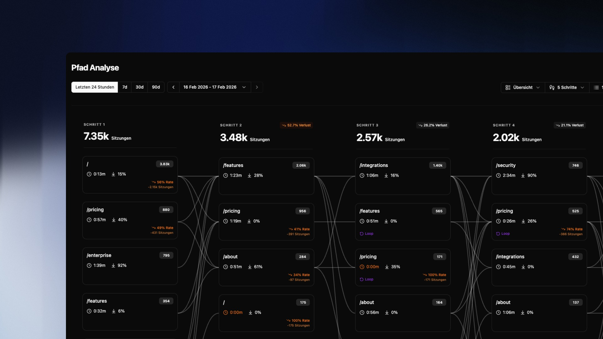

## Übersicht

Die Pfad Analyse visualisiert die häufigsten Navigationswege deiner Besucher als Sankey-Diagramm. Jede Spalte entspricht einem Interaktionsschritt – von der Einstiegsseite bis zu mehreren Klicks tief in die Session. Die Verbindungslinien zwischen den Spalten zeigen, wie Besucher von einer Seite zur nächsten fließen.

So erkennst du auf einen Blick: Wo steigen Nutzer ein, welche Wege führen zur Conversion, und an welchen Stellen brechen Sessions ab.

---

## Das Diagramm lesen

Jede Box in einer Spalte repräsentiert eine Seite und zeigt drei Kennzahlen:

| Kennzahl | Bedeutung |
|---|---|
| **Zahl oben rechts** | Anzahl der Sitzungen, die diese Seite in diesem Schritt erreicht haben |
| **Uhr-Symbol** | Durchschnittliche Verweildauer auf dieser Seite |
| **Pfeil-Symbol** | Absprungrate dieser Seite |

Über jeder Spalte siehst du die Gesamtzahl der Sitzungen in diesem Schritt sowie den prozentualen Verlust gegenüber dem vorherigen Schritt. Ein Verlust von **52,7%** zwischen Schritt 1 und 2 bedeutet, dass mehr als die Hälfte der Besucher nach dem ersten Schritt die Session beendet hat.

> Ein **Loop**-Label auf einer Seite bedeutet, dass Besucher diese Seite in derselben Session mehrfach aufgerufen haben – ein Hinweis auf Orientierungslosigkeit oder aktives Wiederkehren zu einem wichtigen Inhalt.

---

## Steuerung & Ansicht

Die Toolbar oben rechts gibt dir vier Hebel zur Analyse:

**Ansichtsmodus**

Wechsle zwischen drei Ansichten:
- **Übersicht** — Alle Pfade in der Standarddarstellung
- **Verluste** — Hebt Seiten mit hohen Absprungraten hervor (orange markiert)
- **Loops** — Zeigt nur Seiten, auf die Nutzer mehrfach zurückkehren (lila markiert)

**Tiefe der Analyse**

Wähle zwischen 3 und 7 Schritten. Mehr Schritte zeigen längere Sessions, können aber unübersichtlicher werden. Für die meisten Websites sind 5 Schritte ein guter Ausgangspunkt.

**Anzahl der Pfade**

Steuere wie viele Seiten pro Spalte angezeigt werden: 100, 250, 500 oder 1.000 Pfade. Seltene Pfade werden standardmäßig in **„X weitere Seiten..."** gruppiert.

**Pfad Konfiguration**

Definiere einen spezifischen Start- und Endpunkt für die Analyse:
- **Startpunkt** — z.B. `/pricing` um nur Pfade zu sehen, die auf der Preisseite beginnen
- **Zielseite** — z.B. `/checkout` um rückwärts zu analysieren, welche Wege zum Checkout führen

---

## Gruppierte Seiten aufschlüsseln

Wenn eine Spalte viele seltene Seiten enthält, werden sie in einer **„X weitere Seiten..."** Box zusammengefasst. Klicke auf **Details**, um die vollständige Liste aufzuklappen und alle gruppierten URLs mit ihren Sitzungszahlen zu sehen.

Einzelne URLs kannst du direkt aus der Gruppe lösen — sie erscheinen dann als eigene Box im Diagramm.

---

## Typische Analysen

**Absprungpunkte finden**
Ein hoher Verlust zwischen zwei Schritten zeigt wo Sessions enden. Ist der Übergang unklar? Fehlt ein Call-to-Action? Kombiniere die Verlust-Ansicht mit dem Filter, um betroffene Seiten direkt anzugehen.

**Conversion-Pfade rekonstruieren**
Setze deine Checkout- oder Danke-Seite als Zielseite in der Pfad Konfiguration. Das Diagramm zeigt dir rückwärts, über welche Wege Nutzer tatsächlich konvertieren.

**Loop-Verhalten verstehen**
Loops auf Navigationsseiten (z.B. `/`) sind ein Warnsignal – Nutzer finden nicht was sie suchen. Loops auf Inhaltsseiten können positiv sein und auf hohe Relevanz hindeuten.

> Kombiniere die Pfad Analyse mit Nutzergruppen, um Conversion-Pfade von transaktionellen Nutzern isoliert zu betrachten.