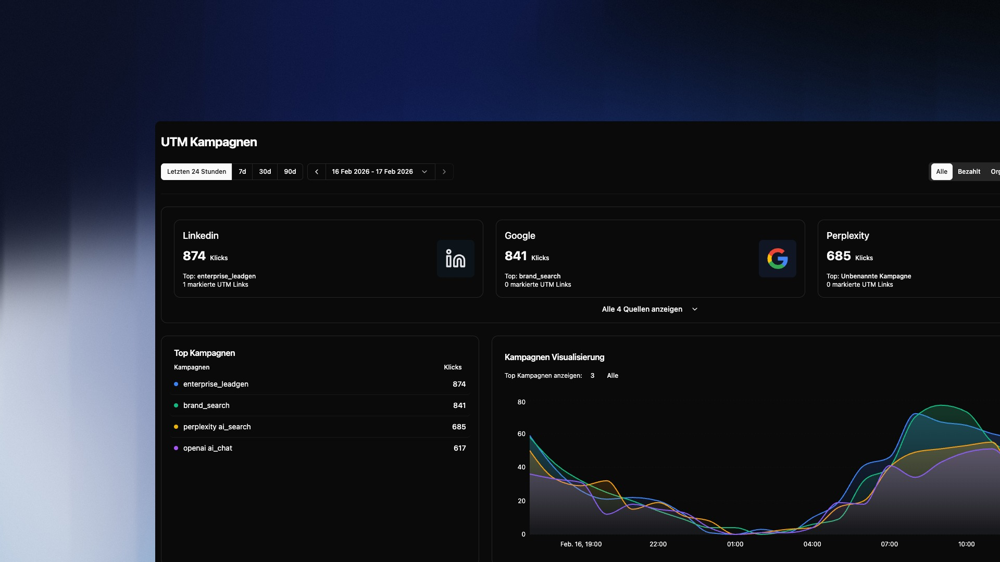

## Übersicht

UTM Kampagnen ermöglichen dir den Erfolg externer Marketingmaßnahmen präzise zu messen. Erstelle spezielle Links für Newsletter, Social-Media-Posts oder Anzeigen und sieh genau, wie viele Klicks und Sitzungen jede Kampagne generiert – aufgeschlüsselt nach Quelle, Medium und Kampagnenname.

> Dein System erfasst automatisch alle eingehenden Links mit UTM-Parametern. Der Link-Builder sorgt zusätzlich für konsistente und fehlerfreie Parameter.

---

## Das Dashboard

### Quellen-Karten

Oben siehst du eine Karte pro Traffic-Quelle (z.B. LinkedIn, Google, Perplexity). Jede Karte zeigt:

- **Gesamtklicks** aus dieser Quelle
- **Top Kampagne** — die erfolgreichste einzelne Kampagne dieser Quelle
- **Markierte UTM Links** — Anzahl der manuell erstellten Links für diese Quelle

Klicke auf **Alle X Quellen anzeigen** um alle Quellen aufzuklappen.

### Top Kampagnen

Listet alle Kampagnen nach Klicks sortiert. Die farbigen Punkte korrespondieren direkt mit den Linien in der Kampagnen Visualisierung rechts daneben.

### Kampagnen Visualisierung

Der interaktive Graph zeigt den zeitlichen Verlauf der Klicks deiner Top-Kampagnen. Oben rechts kannst du zwischen **Klicks** und **Sitzungen** wechseln. Über **Top Kampagnen anzeigen** steuerst du wie viele Kampagnen gleichzeitig im Graph dargestellt werden.

---

## Filterleiste

Die Toolbar oben gibt dir drei Hebel:

- **Zeitraum** — vordefinierte Optionen (24h, 7d, 30d, 90d) oder ein benutzerdefinierter Zeitraum
- **Kampagnen-Typ** — filtere zwischen `Alle`, `Bezahlt` und `Organisch` um verschiedene Marketing-Taktiken zu vergleichen
- **+ Neuen UTM Link erstellen** — öffnet den Link-Builder

---

## UTM Link erstellen

Klicke auf **+ Neuen UTM Link erstellen** in der Toolbar. Fülle die folgenden Felder aus:

**Pflichtfelder:**

| Parameter | Beschreibung | Beispiel |
| -------------------- | -------------------------------------------- | ----------------------- |
| `utm_source` | Woher kommt der Traffic? | `linkedin`, `google` |
| `utm_medium` | Wie kommt der Traffic? | `cpc`, `email`, `social` |
| `utm_campaign` | Welche Kampagne ist es? | `enterprise_leadgen` |

> Denk an UTM-Parameter wie eine Adresse: **Quelle** ist die Stadt (woher), **Medium** ist die Straße (wie), **Kampagne** ist der Grund des Besuchs (warum).

Der generierte Link wird dir in Echtzeit angezeigt. Kopiere ihn mit einem Klick und verwende ihn in deinen Marketingmaterialien – jeder Klick wird automatisch erfasst und der richtigen Kampagne zugeordnet.

---

## Häufige Fragen

**Warum sehe ich "Unbenannte Kampagne" im Dashboard?**
Das passiert wenn ein eingehender Link zwar `utm_source` oder `utm_medium` enthält, aber `utm_campaign` fehlt oder leer ist. Stelle sicher dass alle drei Parameter gesetzt sind.

**Muss ich jeden Link mit dem Tool erstellen?**
Nein. UTM-Parameter in eingehenden Links werden automatisch erkannt und erfasst. Der Link-Builder hilft dir dabei konsistente Schreibweisen sicherzustellen – z.B. immer `linkedin` statt mal `LinkedIn` und mal `linked-in`.