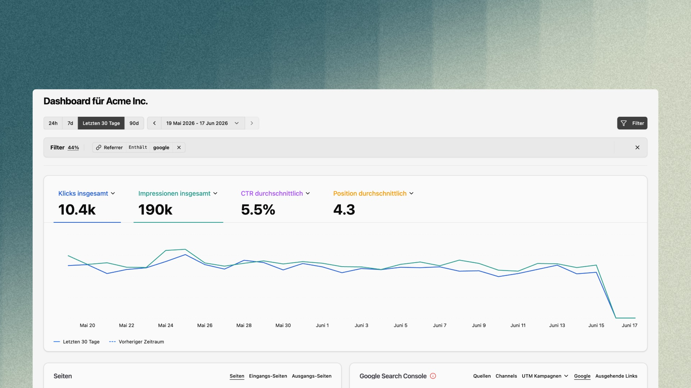

{/* TODO: finales Bild einfügen */}

> Mit der Google-Search-Console-Integration holst du deine Suchdaten direkt in bchic Analytics. So siehst du, wie deine Seiten in der Google-Suche performen – ohne zwischen zwei Tools wechseln zu müssen. Und weil deine bchic-Filter auch auf die Suchdaten wirken, verbindest du erstmals Suchperformance und On-Site-Verhalten in einer Ansicht.

## Einrichtung

Die Verbindung erfolgt unter **Einstellungen → Integrationen**:

1. Öffne **Einstellungen → Integrationen** und wähle **Google Search Console**.
2. Verbinde dein Google-Konto per **OAuth** und bestätige die Freigabe.
3. Wähle die zu verknüpfende Property aus.

---

## Was die Integration liefert

Nach der Verbindung erhältst du ein eigenes **GSC-Dashboard** mit vier Kernmetriken:

| Metrik | Bedeutung |
|---|---|
| **Klicks insgesamt** | Wie oft Nutzer aus der Google-Suche auf deine Seite geklickt haben |
| **Impressionen insgesamt** | Wie oft deine Seiten in den Suchergebnissen erschienen sind |
| **Durchschnittliche CTR** | Verhältnis von Klicks zu Impressionen |
| **Durchschnittliche Position** | Die durchschnittliche Ranking-Position in den Suchergebnissen |

Die Metriken lassen sich als **Zeitreihe** darstellen und einzeln umschalten. Ein **Vorperioden-Vergleich** zeigt dir die Entwicklung gegenüber dem vorherigen Zeitraum.

---

## Dimensionen: Suchanfragen, Seiten, Länder & mehr

Die GSC-Integration zeigt dir nicht nur die vier Kennzahlen, sondern schlüsselt deine Suchperformance nach mehreren Dimensionen auf. Jede Zeile enthält **Besucher**, **Impressionen**, **CTR** und **Position** und ist sortier-, durchsuch- und paginierbar.

Über den **Expand-Button** öffnest du die Detailansicht mit allen Dimensionen als Tabs:

| Dimension | Was du siehst |
|---|---|
| **Suchanfragen** | Über welche Suchbegriffe Nutzer dich finden |
| **Seiten** | Welche deiner Seiten in der Suche ranken |
| **Länder** | Aus welchen Ländern die Suchzugriffe kommen |
| **Geräte** | Verteilung auf Desktop, Mobil und Tablet |
| **Darstellung in der Suche** | Wie deine Treffer erscheinen (z. B. normale Ergebnisse, Rich Results) |
| **Daten** | Entwicklung im Zeitverlauf |

---

## Google-Tab im Quellen-Widget

Im Dashboard erscheinen die GSC-Daten als eigener **„Google"-Tab** im Quellen-Widget – neben **Quellen**, **Channels**, **UTM Kampagnen** und **Ausgehenden Links**. In der kompakten Ansicht siehst du direkt die wichtigsten **Suchbegriffe** mit ihren Kennzahlen; über **Expand** springst du in die volle Dimensionsansicht, über das **Aktualisieren**-Icon holst du die neuesten Daten. So hast du die Suchperformance immer im Kontext deiner übrigen Traffic-Quellen.

---

## Filter wirken auch auf deine GSC-Daten

Der entscheidende Unterschied zur Search Console selbst: **deine bchic-Filter greifen auch auf die Google-Daten.** Filter, die sich auf eine GSC-Dimension abbilden lassen – allen voran **Seite/Pfad**, aber auch **Land** und **Gerät** – grenzen die Suchdaten entsprechend ein.

Ein Beispiel: Filterst du auf deine **Startseite**, zeigt dir der Google-Tab nur noch die Suchbegriffe, über die genau diese Seite gefunden wurde. Damit beantwortest du Fragen, die in der Search Console mühsam sind:

- Über welche Keywords wird eine bestimmte Landingpage tatsächlich gefunden?
- Wie performt eine einzelne Seite in der Suche – und passt das zu ihrem On-Site-Verhalten (Verweildauer, Conversions)?

<Note>
    Es lassen sich nur Filter anwenden, die eine Entsprechung in den GSC-Dimensionen haben. Filter ohne Pendant in den Search-Console-Daten (z. B. rein verhaltensbasierte Segmente) wirken auf den Google-Tab nicht.
</Note>

---

## Berechtigungen

Der Zugriff ist über zwei verschiedene Rechte geregelt (siehe [Rollen & Berechtigungen](/de/settings/admin/roles-permissions)):

- **Google Search Console nutzen** (Capability) — erlaubt das Ansehen der GSC-Daten. Standardmäßig für **alle Rollen** aktiv.
- **Google Search Console verwalten** (Admin-Berechtigung) — erlaubt das **Einrichten und Verwalten** der Integration (Google-Konto verbinden, Property wählen).

---

## MCP-Zugriff

Die GSC-Daten sind auch über den **MCP-Server** abrufbar. So kannst du deine Suchperformance per natürlicher Sprache in Claude oder Cursor abfragen – etwa „Über welche Keywords wird meine Startseite gefunden?" oder „Wie hat sich meine durchschnittliche Position diesen Monat entwickelt?".