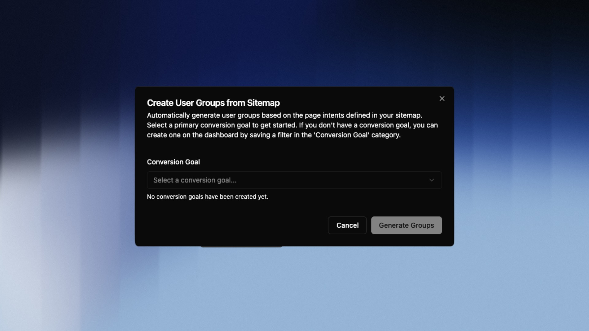

## Overview

User Groups automatically classify every visitor session based on the highest purchase intent shown during that session. The result is three clearly distinct groups:

| Group | Meaning |
|---|---|
| **Informational** | The visitor consumed purely informational content |
| **Commercial** | The visitor viewed pages with commercial intent (e.g. Pricing, Features, Comparisons) |
| **Transactional** | The visitor triggered the defined conversion goal |

A visitor who browses a pricing page and then completes a purchase is classified as **transactional** – only the highest intent level reached in a session counts.

> [!NOTE]
> User Groups require two things to be set up first: a completed **Sitemap Classification** and a defined **Conversion Goal**. Both are configured once – the steps below walk you through the process.

---

## Prerequisite: Sitemap Classification

The foundation for all User Groups is your Sitemap Classification. This is where you define which pages on your website are considered informational or commercial. bchic Analytics uses these assignments to automatically score every session.

---

## Step 1: Define a Conversion Goal

The conversion goal marks the transactional endpoint – the moment a visitor becomes a customer or lead.

Common examples:

- A completed purchase (`Event: purchase`)
- A successful registration (`URL: /thank-you-signup`)
- A booking confirmation (`Event: booking_confirmed`)

> [!TIP]
> Choose a goal that is unambiguous and irreversible. Visiting a product page doesn't count – completing a purchase does.

---

## Step 2: Create a Filter for the Conversion Goal

The conversion goal is created via the Filter function.

1. **Open the filter bar** — Click `Filter` in the top right.
2. **Set your criteria** — Define the condition that describes your goal, e.g. *Event is "purchase"* or *Page path is "/order-thank-you"*.
3. **Save** — Click the **floppy disk icon** in the bottom right of the filter bar.

In the save dialog:

- **Filter name** — e.g. `Purchase completed`
- **Category** — Make sure to select `Conversion Goal`

> [!WARNING]
> Without the `Conversion Goal` category, the filter won't appear in the next step. You can edit the category at any time by reopening the filter.

---

## Step 3: Generate Groups

Open **User Groups** and select your newly created filter under **Conversion Goal** in the popup. Click **Generate Groups**.

bchic Analytics will now retroactively evaluate all sessions and assign each one the highest intent level reached.

---

## Reading the Results

After generation, you'll see your sessions split by intent level. For each group you can analyze:

- Which channels did these visitors come from?
- Which entry pages did they use?
- How long did they stay on the website?

The direct comparison between **commercial** and **transactional** is particularly valuable: it shows you which visitors were close to converting – but didn't.

> [!TIP]
> Combine User Groups with Funnel Analysis to pinpoint exactly where commercial visitors drop off in the conversion path.