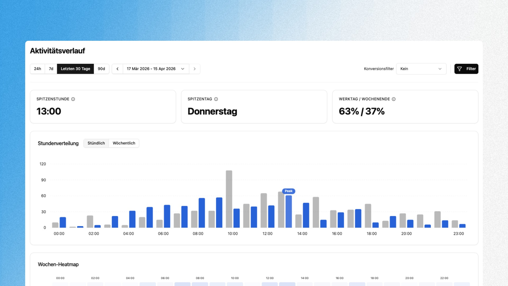

## Overview

The Activity Timeline shows you when your visitors use your website. Instead of just seeing totals, you can identify temporal patterns: which hours bring the most traffic, which day of the week is the strongest and how activity is distributed between weekdays and weekends.

This helps with concrete decisions: when to publish content, when to send newsletters, when to schedule maintenance windows or when your support team should be available.

---

## Finding the Dashboard

The Activity Timeline is located under **User Behavior → Activity Timeline** in the sidebar. The page is always available and does not require any additional configuration.

---

## Time Range and Filters

Use the toolbar at the top to select the analysis period: **24h**, **7d**, **Last 30 Days** or **90d**. Alternatively you can define a custom date range using the date picker. The arrow buttons let you navigate forward or backward step by step.

The **Conversion Filter** on the right lets you narrow the view to sessions that include a specific conversion event. This way you see not just when visitors arrive, but when they convert.

---

## Dashboard Components

### KPI Cards

The three cards at the top surface the key metrics at a glance:

| Metric | Meaning |
|---|---|
| **Peak Hour** | The hour of the day with the highest average traffic in the selected period |
| **Peak Day** | The day of the week with the highest average traffic |
| **Weekday / Weekend** | Percentage split of sessions between Monday through Friday and Saturday/Sunday |

### Hourly Distribution / Weekly Distribution

The bar chart in the middle has two views that you can switch between using the **Hourly** and **Weekly** tabs.

**Hourly** shows the visitor distribution across the 24 hours of a day. Each hour has two bars: the current period (blue) and the previous comparison period (gray). The bar with the highest value is marked with a **Peak** label.

**Weekly** shows the distribution across the seven days of the week in the same two-bar format. This lets you see at a glance whether usage patterns have shifted compared to the previous month or week.

### Weekly Heatmap

The heatmap at the bottom combines both dimensions: days of the week (vertical) and hours of the day (horizontal). The darker a cell, the more traffic falls into that time slot. This lets you spot hotspots like "Thursday 1:00 PM" or quiet phases like "Sunday morning" without having to read individual numbers.

---

## Typical Analyses

**Optimize content timing**
Publish blog posts, social media content or newsletters at times when your audience is actually active. The hourly distribution shows you the window with the highest reach.

**Evaluate weekday vs. weekend**
A high weekend share (e.g. 40%+) suggests a B2C audience. If the weekday share is 80% or more, you are likely looking at a B2B profile. The distribution helps you tailor content and campaigns to the right usage pattern.

**Plan maintenance windows**
The heatmap reliably shows you the quietest time slots of the week. Schedule deployments, migrations or maintenance work during these phases to affect as few users as possible.

**Identify conversion times**
Use the conversion filter to show only sessions with a conversion. If your traffic peak is at 10:00 AM but your conversions happen at 2:00 PM, you know that users need time to make a decision.

> Combine the Activity Timeline with User Groups to analyze peak times for different audiences separately. B2B visitors often have completely different timing than organic blog traffic.