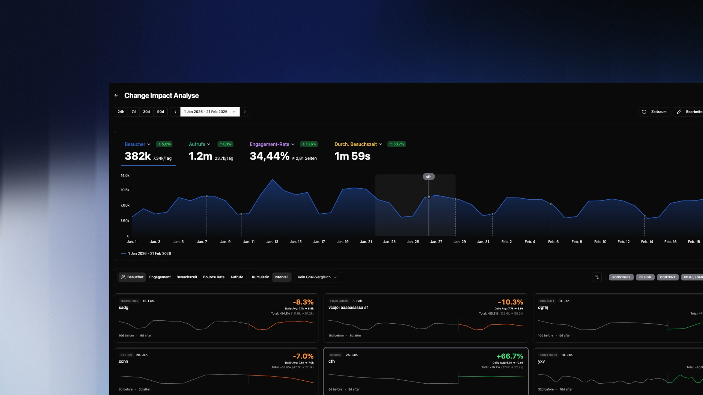
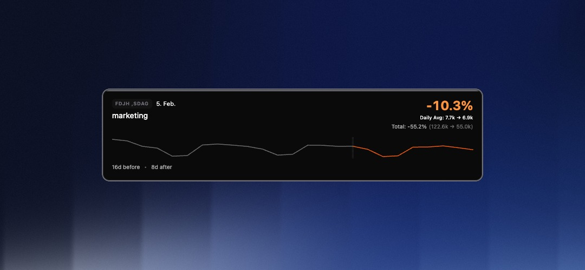

## Overview

Change Impact Analysis (CIA) answers the most critical question after any change: **"What was the actual return?"**

Instead of manually comparing timeframes or guessing whether a traffic spike was caused by your newsletter or pure coincidence, CIA quantifies the effect precisely. You mark a point in time (e.g., a deployment or campaign start), and bchic Analytics calculates the metric changes in a before-and-after comparison.

This is particularly valuable for:
- **Product Teams:** Measuring the ROI of new features.
- **Marketing:** Analyzing the sustainability of campaign traffic.
- **Engineering:** Monitoring performance metrics (e.g., load time) after updates.

---

## Creating Impact Events

To start an analysis, define a **Change Event**. This is the "zero point" from which measurement begins.

Click `+ Add Change` in the overview and fill in the details:

- **Title & Description:** What changed? (e.g., "Homepage Redesign v2").
- **Category:** Choose from `Technical`, `Marketing`, `Content`, `Design`, or `Experiment`. This helps with filtering later.
- **Timestamp:** The exact date and time the change went live.

> **Tip:** Be as precise as possible with the timestamp. The more accurately the start point is defined, the sharper the distinction between "before" and "after" in the data.

---

## The Analysis Card

Once an event is created, the system generates an Impact Card ("Scorecard") below the main graph. This card is the core of the evaluation.

Each card shows you at a glance:

1.  **Percentage Change:** The large number (e.g., `+8.6%`) shows the difference in the selected metric compared to the previous period.
2.  **Trend Graph:** The white line shows actual performance after the event. The gray line visualizes the trend *before* the event for comparison.
3.  **Total & Average:**
- **Daily Avg:** The average daily value (Before vs. After).
- **Total:** The absolute sum of interactions in the compared periods.

---

## Quick Start with Templates

To minimize setup effort, CIA offers pre-configured templates for common use cases. When adding a change, simply select a template:

### Interval Template
*“How are my metrics changing over time?”*
Automatically generates recurring impact markers based on a fixed schedule (e.g., every X days, weekly, or monthly).
**Use Case:** Ideal for continuous monitoring or establishing weekly reporting cycles without manually creating events.

### Campaign Template
*“Did my last campaign actually move the needle?”*
Scans your historical UTM data from the past year to automatically detect campaigns. Select the desired campaigns from the list, and the system instantly creates the corresponding impact markers.
**Use Case:** Immediate, retrospective evaluation of marketing efforts. Filterable by `Paid`, `Organic`, and `Min. Clicks`.

---

## Goal Comparison & A/B Testing

Beyond general metrics (like visitors or views), you can measure how changes affect specific conversion goals. Using the **"Goal Comparison"** dropdown, you can place two goals side-by-side to directly compare their performance (A/B Testing).

**How to set up a Goal Comparison:**
1. **Define Goal:** Open the main filter bar (`Y`) at the top right and set the conditions that define your conversion goal (e.g., *Visited Page = /checkout/success*).
2. **Save Goal:** Click the save icon and ensure you select the category "Conversion-Ziel" (Conversion Goal).
3. **Compare:** Select your saved goal from the dropdown in the CIA dashboard.

**Use Case:** A/B Testing. Place two distinct conversion paths or user segments next to each other. After an event occurs, you instantly see whether Variant A or Variant B had a more positive impact.

---

## Cumulative vs. Interval

You can switch the calculation mode in the top left of the dashboard. The choice depends on your objective:

### Interval (Phase Comparison)
Focuses exactly on the phase from the **start of the change to the next change** (or until today, if no subsequent change follows).
*   **Comparison:** This period is compared against a baseline of **twice the duration** prior to the event.
*   **Goal:** Isolates the effect of a specific version or campaign before the next factor (next marker) interferes. Ideal for checking stability between two deployments.

### Cumulative (Total Impact)
Continuously sums up the effect since the start time, ignoring subsequent markers.
*   **Goal:** Shows the absolute "yield" (e.g., total additional conversions) over the entire runtime.

---

## Comparison Periods & Filters

Vertical dashed lines mark your Change Events. Clicking an Impact Card highlights the corresponding period in the main graph. This lets you immediately see if a change correlates with global trends or had an isolated impact.

Use the **Category Filters** (top right above the cards) to, for example, show only `Marketing` events and hide technical deployments.

---

## Typical Analyses

**Did the redesign improve user retention?**
Create a `Design` category event. Select "Engagement Rate" or "Avg. Visit Duration" as the metric. A positive green value confirms the new UI keeps users engaged longer.

**Is the paid campaign worth it?**
Mark the ad start as a `Marketing` event. Switch to "Cumulative" and observe the "Visitors" metric. Compare the increase ("Total") with your ad spend to roughly estimate CPA (Cost per Acquisition).

**Monitor performance after deployment**
Create a `Technical` event after every release. Monitor "Bounce Rate" and "Views". A sudden spike in Bounce Rate immediately after the event often indicates technical errors or 404 issues.