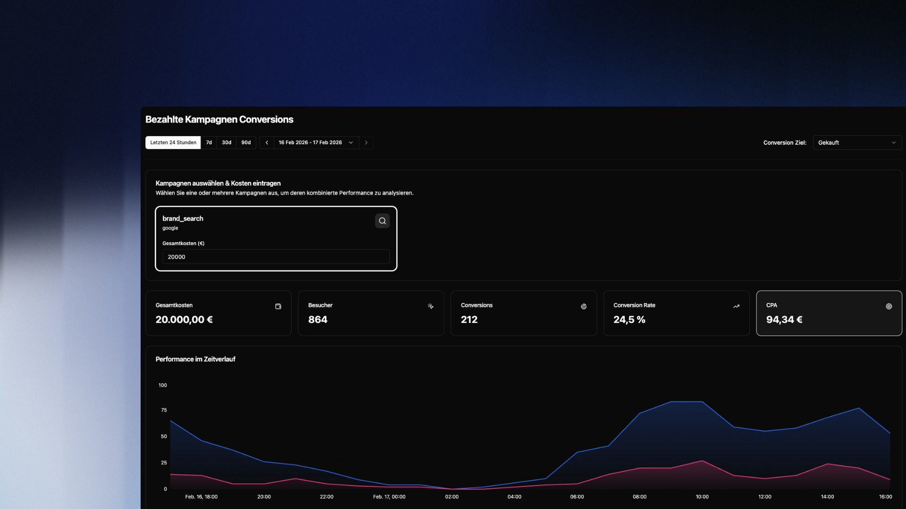

## Overview

Paid Campaign Conversions connects your UTM campaign data with a defined conversion goal. Enter the total cost of a campaign and instantly see the key performance metrics: how many visitors the campaign brought, how many converted, and what each conversion cost you.

---

## Select Campaign & Enter Costs

Select one or more campaigns from your UTM campaigns at the top of the page. For each campaign, enter the **total cost in euros**.

You can select multiple campaigns simultaneously to analyze their combined performance – useful when you've run a campaign across multiple channels.

> Costs are entered manually and are not automatically synced from an ad platform. Enter the total amount you were charged for the selected time period.

Select your **Conversion Goal** in the top right. Only filters categorized as `Conversion Goal` will appear here. If your goal is missing, set it up first in the [User Groups configuration](/en/intent/usergroups).

---

## The Metrics

| Metric | Meaning |
| -------------------- | --------------------------------------------------------------- |
| **Total Costs** | The entered campaign costs for the selected time period |
| **Visitors** | Number of sessions that arrived on the website via this campaign |
| **Conversions** | Number of sessions that reached the conversion goal |
| **Conversion Rate** | Share of visitors who converted |
| **CPA** | Cost per Acquisition – total costs divided by number of conversions |

> CPA is your most important metric. Compare it to your average customer lifetime value (LTV) to assess whether your campaign is profitable.

---

## Performance Over Time

The chart shows two lines:

- **Campaign Visitors** (blue) — all sessions from this campaign
- **Visitors with Conversion** (pink) — only the sessions that reached the goal

This lets you see at which times conversions occur and whether there is a time delay between click and conversion.

---

## Top Converting Pages

Shows which pages were visited most frequently during a conversion session. These are not necessarily the last pages before conversion, but all pages that converters visited along the way.

Use this list to understand which content conversion-relevant visitors consume.

---

## Top Exit Pages

Shows on which pages campaign visitors left the website without converting. A high exit rate on `/pricing` for example is a direct signal for optimization needed on that page.

> Combine Top Exit Pages with [Path Analysis](/en/plattform/pages/journeys) to see what users did on these pages before dropping off.