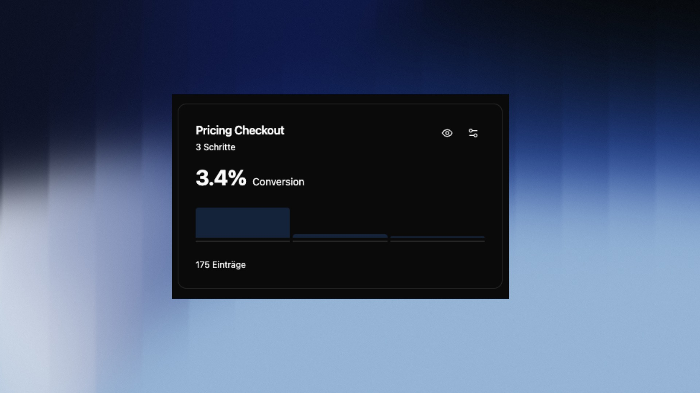

## Overview

Funnel Analysis shows you how many visitors complete each step of a defined conversion path. Unlike Path Analysis – which shows what users actually do – with funnels you define which steps you want to measure yourself. The result is a clear step-by-step view with conversion and drop-off rates for every transition.

---

## Create a Funnel

Open **Funnel Analysis** and click **New Funnel**. Fill in the following fields:

- **Name** — e.g. `Pricing Checkout Q1`
- **Description** — optional, but helpful when managing multiple funnels
- **Time Window (Minutes)** — the maximum time allowed between steps for a conversion to be valid. Default: 30 minutes. A user who completes step 1 at 10:00 and step 2 at 10:35 would **not** be counted as a conversion with this setting.
- **Funnel active** — inactive funnels are hidden from the overview list

> Adjust the time window to match your typical conversion process. A SaaS signup usually takes under 5 minutes – a B2B inquiry can take days. For the latter, consider 1440 minutes (24h) or more.

Then define the steps of your funnel. Each step can either be a **Page View** or an **Event**:

| Step type | Input | When to use |
| ---------------- | ------------------- | -------------------------------------------- |
| **Page View** | `path/to/page` | Visitor navigated to a specific URL |
| **Event** | `event_name` | Visitor triggered a specific action |

Each step can be given an optional name and you can expand **Advanced Options** for additional filter conditions. Click **+ Add another step** to extend the path, then click **Create Funnel**.

---

## Understanding the Metrics

Each saved funnel shows the key numbers directly in the overview list:

- **Conversion Rate** — share of visitors who completed all steps
- **Entries** — total number of sessions that reached the first step

Opening a funnel reveals four summary metrics:

| Metric | Meaning |
| ----------------------------- | --------------------------------------------------------------- |
| **Overall Conversion Rate** | Share of sessions that completed the entire funnel |
| **Completed Sessions** | Absolute number of successful completions |
| **Average Duration** | How long users take on average from the first to the last step |
| **Biggest Drop-off** | The step with the highest percentage loss |

---

## Funnel Visualization

The **Funnel Visualization** shows each step as a horizontal bar. The width of the blue bar represents the share of sessions that reached this step – relative to the start.

For each step you can see:
- **Sessions** — absolute count and percentage rate from start
- **Average time spent** — how long users spend on this step
- **Loss** — percentage drop-off compared to the previous step (highlighted in orange)

> The biggest drop-off is automatically highlighted in orange – this is your most important optimization signal.

---

## Trend Analysis

Switch to the **Trend Analysis** tab to see conversions over time as a line chart. This lets you spot whether your conversion rate is improving, declining, or whether there are isolated spikes or dips.

You can toggle between the **Sessions** and **Conversion Rate** view.

---

## Common Analyses

**Optimizing the biggest drop-off**
Look at the step with the highest loss. Combine Funnel Analysis with [Path Analysis](/en/plattform/pages/journeys) to understand what users who drop off at that point do instead.

**Tracking conversion rate over time**
Use the Trend Analysis after making changes to your website – such as a redesign or a new campaign – to directly measure the impact.

**Comparing different paths**
Create multiple funnels for different conversion paths (e.g. Blog → Pricing → Signup vs. Homepage → Pricing → Signup) and compare which route has the higher conversion rate.

> Combine funnels with [User Groups](/en/intent/usergroups) to analyze the path of transactional users in isolation.